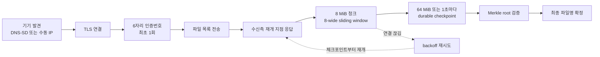

<p align="center">
  
</p>

<h1 align="center">eslee QuickSend</h1>

<p align="center">
  Windows와 Android 사이에서 파일을 같은 LAN으로 직접 주고받는 네이티브 앱입니다. 계정, 클라우드, 중앙 서버가 없고 전송이 여러 번 끊겨도 저장된 지점부터 이어서 완료합니다.
</p>

<p align="center">
  <a href="https://github.com/esleeeeee/eslee-quick-send/releases/tag/v0.0.1"></a>
  
  
  
  
</p>

<p align="center">
  <strong><a href="https://github.com/esleeeeee/eslee-quick-send/releases/tag/v0.0.1">v0.0.1 다운로드</a></strong>
</p>

> **현재 v0.0.1은 시험용 Pre-release입니다.** 정식 안정 릴리즈가 아닙니다.
> 핵심 양방향 전송은 실기기에서 검증했지만 대용량 파일과 반복 단절 복구는 아직 검증하지 않았습니다. 중요한 데이터의 유일한 사본을 옮기는 데 사용하지 마십시오.

## 소개

eslee QuickSend는 PC와 휴대폰이 같은 공유기에 연결되어 있을 때 두 기기가 서로를 찾아 직접 연결합니다. 파일은 인터넷을 거치지 않고 두 기기 사이에서만 이동하며, 중계 서버에 업로드되지 않습니다.

Quick Share처럼 빠르게 보내되, 대용량 전송이 Wi-Fi 끊김이나 화면 꺼짐으로 여러 번 중단되어도 처음부터 다시 보내지 않는 것을 목표로 만들었습니다. 진행률과 재개 지점은 보내는 쪽이 socket에 밀어 넣은 양이 아니라 **받는 쪽이 디스크에 영구 저장했다고 확인한 지점**만 사용합니다.

모든 설정, 신뢰 기기, 전송 기록은 각 기기의 로컬 저장소에만 보관합니다. 계정 가입, 텔레메트리, 광고 SDK, 외부 서버 전송은 없습니다.

## 주요 기능

### 자동 발견과 수동 IP 연결

같은 LAN의 QuickSend 기기를 DNS-SD로 자동으로 찾습니다. 회사망이나 게스트 Wi-Fi처럼 mDNS가 차단된 환경에서는 상대 기기의 IP와 포트를 직접 입력해 연결할 수 있습니다.

### TLS와 6자리 인증번호 페어링

모든 데이터 경로는 TLS로 암호화합니다. 처음 연결할 때 양쪽 화면에 같은 6자리 숫자가 표시되며, 두 숫자가 일치하는지 사용자가 직접 확인해야 신뢰가 등록됩니다. 이후에는 인증서 공개키 지문으로 기기를 식별하므로 다시 묻지 않습니다.

설치별로 독립된 cryptographic identity를 사용하며 Android는 Keystore, Windows는 사용자 인증서 저장소에 보관합니다.

### 양방향 전송

Windows → Android와 Android → Windows 모두 지원합니다. 단일 파일, 다중 파일, 폴더, 폴더와 파일을 섞은 전송을 처리하며 폴더 구조를 유지합니다. Windows에서는 창 어디에나 파일과 폴더를 끌어다 놓을 수 있습니다.

### 끊겨도 이어받기

8 MiB 청크를 최대 8개까지 동시에 보내는 sliding window 방식이며, 청크마다 ACK를 기다리는 stop-and-wait이 아닙니다. 받는 쪽은 64 MiB 또는 1초 중 먼저 도달한 시점에 부분 파일을 flush하고 체크포인트를 영구 저장합니다.

연결이 끊기면 `2, 5, 10, 20, 30, 60…초` backoff로 자동 재시도하고, 네트워크 변경이나 기기 재발견 이벤트가 오면 즉시 다시 시도합니다. 앱을 껐다 켜도 마지막 체크포인트부터 이어집니다.

중단 후 7일 이내의 작업만 자동 복구 대상입니다. 그보다 오래된 작업은 자동 복구를 멈추고 정리할 수 있는 상태로 전환하며, 이때도 원본 파일과 이미 완료된 파일은 삭제하지 않습니다.

### 연결 끊기와 다시 연결

기기 목록에서 특정 상대와의 현재 연결만 끊을 수 있습니다. 이것은 신뢰 해제나 기기 삭제가 아니므로 신뢰 기기 등록과 인증서는 그대로 유지되고, 다시 연결할 때 6자리 인증번호를 새로 확인하지 않습니다.

수동으로 끊은 뒤에는 자동 재연결이 곧바로 다시 붙지 않습니다. 전송 중에 끊어도 데이터는 손상되지 않으며 다시 연결하면 저장된 지점부터 이어집니다.

### 전송 대기열

이미 전송 중일 때 새 파일을 추가하면 `대기열 1번째`, `대기열 2번째`처럼 순서를 표시하고, 앞 작업이 끝나면 사용자가 누르지 않아도 자동으로 시작합니다. 상태 문구는 실제 의미에 맞게 구분합니다.

| 표시 | 의미 |
| --- | --- |
| `전송 중` | 실제로 바이트가 이동 중 |
| `대기열 N번째` | 상대 기기는 연결되어 있고 앞 작업의 순서를 기다리는 중 |
| `기기 연결 대기` | 상대 기기를 아직 찾지 못함 |
| `연결 복구 중` | 네트워크 단절 후 자동 복구 중 |
| `일시정지` | 사용자가 일시정지 |
| `연결 끊김` | 사용자가 수동으로 연결을 끊어 보류 중 |

### 전송 기록

보낸 기록과 받은 기록을 함께 보여주며 앱을 다시 켜도 유지됩니다. 새 전송이 끝나면 새로고침을 누르지 않아도 목록에 바로 반영됩니다.

기록 삭제는 **목록에서만 지우는 동작**입니다. 보낸 원본 파일과 받은 파일은 절대 삭제하지 않습니다. 진행 중인 작업의 기록은 보호되며, `기록 정리`는 완료·취소·실패 기록과 더 이상 진행되지 않는 오래된 기록만 제거합니다.

### Android 수신 위치 표시

Android는 SAF(Storage Access Framework)로 수신 폴더를 지정합니다. 화면에는 개발자용 `content://` URI 대신 `내장 저장소/다운로드/퀵쉐어/파일명.ext` 형태의 읽을 수 있는 위치를 표시합니다.

Android 보안 모델상 실제 절대 경로를 얻을 수 없는 경우에도 가짜 경로를 만들지 않고, 선택한 폴더명과 최종 파일명을 조합한 표시 경로를 사용합니다.

### 기기 이름 변경

주변 기기 목록에 표시될 이름을 직접 지정할 수 있습니다. 한글을 사용할 수 있고 최대 32자입니다. 이름을 바꿔도 stable device ID, 인증서 지문, 신뢰 관계는 그대로 유지되므로 재페어링이 발생하지 않습니다.

### Windows 트레이 상주

메인 창의 X 버튼은 종료가 아니라 트레이 숨김입니다. 창이 숨겨져 있어도 수신 대기, 기기 발견, 진행 중인 전송이 계속됩니다. 완전 종료는 트레이 메뉴의 `종료`만 수행하며 전송 중이면 확인을 먼저 묻습니다.

설치 시 선택하면 Windows 로그인 후 창 없이 트레이에서 자동 시작합니다. 프로세스는 항상 하나만 실행되며, 다시 실행하면 새 창을 만들지 않고 기존 창을 복원합니다.

### Android 포그라운드 서비스

Android는 연결을 유지하기 위해 포그라운드 서비스를 사용합니다. 알림은 상태에 따라 명확히 구분됩니다.

- 연결 전: 정적 알림, 진행 표시 없음
- 연결됨(대기): `<상대 기기 이름>에 연결됨`, 진행 표시 없음
- 전송 중: 진행률, 퍼센트, 속도, 남은 시간
- 복구 중: 실제 재연결 중일 때만 복구 표시
- 전송 완료: 약 6초간 결과를 보여준 뒤 연결됨 대기 상태로 복귀

아무 작업도 없는데 로딩 표시가 계속 도는 상태는 발생하지 않습니다.

## 작동 원리



## 핵심 불변 조건

- 진행률과 재개 offset은 송신 socket의 전송량이 아니라 **수신측 durable checkpoint**만 사용합니다.
- 청크마다 SHA-256을 검증하고, 파일 전체는 최종 Merkle root로 검증합니다.
- 최종 파일명은 모든 청크 검증, 길이와 Merkle root 검증, durable flush가 끝난 후에만 확정합니다.
- 기존 파일을 자동으로 덮어쓰지 않고 `파일 (1).ext` 형식으로 새 이름을 선택합니다.
- 전송 도중 원본 metadata가 바뀌면 해당 파일만 `확인 필요`로 격리하고 변경되지 않은 파일은 계속 보냅니다.
- 인증서 identity가 신뢰 DB와 다르면 데이터를 요청하기 전에 연결을 거부합니다.
- 기록 삭제와 실제 파일 삭제는 완전히 분리되어 있습니다.

## 지원 환경과 실제 검증 범위

| 항목 | 상태 |
| --- | --- |
| Windows 10/11 x64 | 지원, 설치형·포터블 실제 실행 검증 완료 |
| Android 8.0 이상 (minSdk 26, target 36) | 지원, Galaxy 실기기 검증 완료 |
| 자동 발견 (mDNS / NSD) | 실기기 양방향 발견 검증 완료 |
| 6자리 SAS 페어링 | 실기기 검증 완료 |
| 작은 파일 양방향 전송 | 실기기 검증 완료 |
| 연결 끊기 · 다시 연결 · 재연결 후 전송 | 실기기 검증 완료 |
| 창을 숨긴 상태의 백그라운드 수신 | 실기기 검증 완료 |
| Android 덮어쓰기 설치 후 데이터 유지 | 실기기 검증 완료 |
| 대용량 전송 (1GB / 10GB / 50GB / 100GB) | **검증 전** |
| 반복 단절 및 99% 지점 단절 복구 | **검증 전** |
| 앱·프로세스 재시작 복구 | 자동 테스트만 수행, 실기기 검증 전 |
| Quick Share 대비 처리량 비교 | **측정 전** |
| 인터넷 중계 전송 | 지원하지 않음 (v1 범위 밖) |

자세한 검증 기록은 [docs/VALIDATION.md](docs/VALIDATION.md)에 수행한 것과 수행하지 않은 것을 구분해 정리합니다.

## 설치

### Windows — 설치형 (권장)

1. [v0.0.1 Release](https://github.com/esleeeeee/eslee-quick-send/releases/tag/v0.0.1)에서 `eslee-QuickSend-Windows-x64-v0.0.1-Setup.exe`를 내려받습니다.
2. 설치 프로그램을 실행합니다. 관리자 권한이 필요 없는 현재 사용자 단위 설치이며 `%LOCALAPPDATA%\Programs\eslee QuickSend`에 설치됩니다.
3. 필요하면 `Windows 시작 시 자동 실행`과 바탕화면 바로가기를 선택합니다.
4. 첫 실행 시 Windows 방화벽에서 **사설 네트워크 허용**이 필요할 수 있습니다.

업데이트 설치와 기본 제거는 설정, 신뢰 기기, 전송 기록, 진행 중이던 부분 파일을 보존합니다. 제거할 때 사용자 데이터까지 지울지 선택할 수 있으며 기본값은 보존입니다.

### Windows — 포터블

1. `eslee-QuickSend-Windows-x64-v0.0.1-Portable.zip`을 내려받아 압축을 풉니다.
2. **압축을 푼 폴더 안에서** `eslee QuickSend.exe`를 실행합니다.

EXE만 다른 곳으로 옮기면 실행되지 않습니다. WinUI 리소스와 self-contained 런타임이 같은 폴더에 있어야 합니다.

> 설치형과 포터블은 같은 사용자 데이터 경로를 사용합니다. 두 버전을 동시에 실행하지 마십시오. 포터블로 등록한 신뢰 기기와 전송 기록은 설치형에서도 그대로 이어집니다.

### Android

1. `eslee-QuickSend-Android-v0.0.1-debug.apk`를 내려받습니다.
2. 시험 단계이므로 debug 서명 APK입니다. 설치 시 출처를 알 수 없는 앱 허용이 필요할 수 있습니다.
3. 첫 실행에서 알림 권한을 허용하고 **받은 파일을 저장할 폴더를 지정**합니다.

기존 앱 위에 덮어쓰기 설치하면 신뢰 기기, 수신 폴더 설정, 전송 기록이 유지됩니다.

배포 파일은 코드 서명되어 있지 않습니다. Windows SmartScreen이나 Android가 게시자를 확인할 수 없다는 경고를 표시할 수 있습니다.

## 빠른 시작

1. PC와 휴대폰을 **같은 공유기**에 연결합니다. PC가 유선, 휴대폰이 Wi-Fi여도 같은 네트워크면 됩니다.
2. 양쪽에서 QuickSend를 실행합니다. 잠시 후 주변 기기 목록에 서로가 나타납니다.
3. 목록에서 상대 기기를 선택하고 파일이나 폴더를 보냅니다. Windows에서는 창에 끌어다 놓아도 됩니다.
4. 처음 연결이면 양쪽에 6자리 숫자가 표시됩니다. **두 숫자가 같은지 확인한 뒤** 신뢰를 승인합니다.
5. 전송이 시작되면 진행률과 남은 시간이 표시됩니다.

기기가 보이지 않으면 Windows 화면의 IP 주소를 확인해 Android의 `IP 주소로 직접 연결`에 입력하십시오. 절차는 [docs/MANUAL-IP-TEST.md](docs/MANUAL-IP-TEST.md)에 정리되어 있습니다.

## 사용 시 알아두기

- **Windows 창의 X 버튼은 종료가 아닙니다.** 트레이로 숨기며 파일 수신 대기가 계속됩니다. 완전히 끄려면 트레이 아이콘의 `종료`를 사용하십시오.
- QuickSend는 하나의 프로세스만 실행됩니다. 다시 실행하면 기존 창이 열립니다.
- Android는 수신 폴더를 지정하기 전에는 파일을 받을 수 없습니다.
- 전송 기록을 삭제해도 실제 파일은 지워지지 않습니다.
- 연결 끊기는 신뢰 해제가 아닙니다. 다시 연결할 때 인증번호를 새로 묻지 않습니다.

## 보안

- 최초 페어링에서만 6자리 코드를 비교하고, 이후에는 인증서 공개키 지문으로 기기를 식별합니다.
- 신뢰 목록에 없는 지문의 기기는 데이터를 요청하기 전 단계에서 연결을 거부합니다.
- private key, 파일 내용, 페어링 비밀은 로그에 기록하지 않습니다.
- 인터넷 중계 기능은 없습니다. 두 기기가 같은 LAN에 있어야만 동작합니다.

## 로컬 데이터와 개인정보

| 플랫폼 | 위치 | 내용 |
| --- | --- | --- |
| Windows | `%LOCALAPPDATA%\eslee\QuickSend` | SQLite DB, 설정, 진단 로그 |
| Windows | `%USERPROFILE%\Downloads\eslee QuickSend` | 받은 파일 기본 위치 |
| Android | 앱 내부 저장소 | SQLite DB, 설정, 진단 로그 |
| Android | 사용자가 지정한 SAF 폴더 | 받은 파일 |

분석, 광고, 외부 서버 전송 코드는 없습니다. 진단 로그에는 문제 해결에 필요한 기기 이름, IP, 파일명, 오류 코드 같은 로컬 정보가 포함될 수 있으므로 공개 이슈에 첨부하기 전에 내용을 확인하십시오.

## 저장소 구성

```text
protocol/                 언어 중립 wire protocol 및 보안 규약
src/QuickSend.Core/       .NET 프로토콜·상태 머신·복구 핵심
src/QuickSend.Windows/    .NET 10 + WinUI 3 Windows 앱
android/                  Kotlin + Jetpack Compose Android 앱
tests/                    단위/통합/장애 주입 테스트
installer/                Inno Setup 설치 스크립트
tools/                    아이콘 생성 등 빌드 보조 스크립트
assets/branding/          앱 아이콘 master 원본
docs/                     아키텍처, 빌드, 테스트, 검증 문서
```

## 직접 빌드 (개발자용)

필요 도구는 .NET 10 SDK, Windows SDK, JDK 21, Android SDK입니다.

```powershell
dotnet build .\QuickSend.slnx
dotnet run --project .\tests\QuickSend.Core.Tests\QuickSend.Core.Tests.csproj
dotnet run --project .\tests\QuickSend.Windows.Persistence.Tests\QuickSend.Windows.Persistence.Tests.csproj

cd android
.\gradlew.bat testDebugUnitTest
.\gradlew.bat assembleDebug
```

Windows 배포본과 설치 파일을 만들려면 다음을 실행합니다.

```powershell
dotnet publish .\src\QuickSend.Windows\QuickSend.Windows.csproj -c Release -r win-x64 --self-contained true
& "$env:LOCALAPPDATA\Programs\Inno Setup 6\ISCC.exe" .\installer\eslee-quicksend.iss
```

앱 아이콘 리소스는 master 원본 하나에서 생성됩니다. 로고를 다시 그리지 않고 배경 제거, 크기 조정, 단색 마스크 파생만 수행합니다.

```powershell
powershell -ExecutionPolicy Bypass -File .\tools\generate-icons.ps1
```

WinUI 패키징과 Android 실기기 실행 절차는 [docs/BUILDING.md](docs/BUILDING.md), 장애·성능 검증 절차는 [docs/TESTING.md](docs/TESTING.md), 내부 구조는 [docs/ARCHITECTURE.md](docs/ARCHITECTURE.md)를 참고하십시오.
