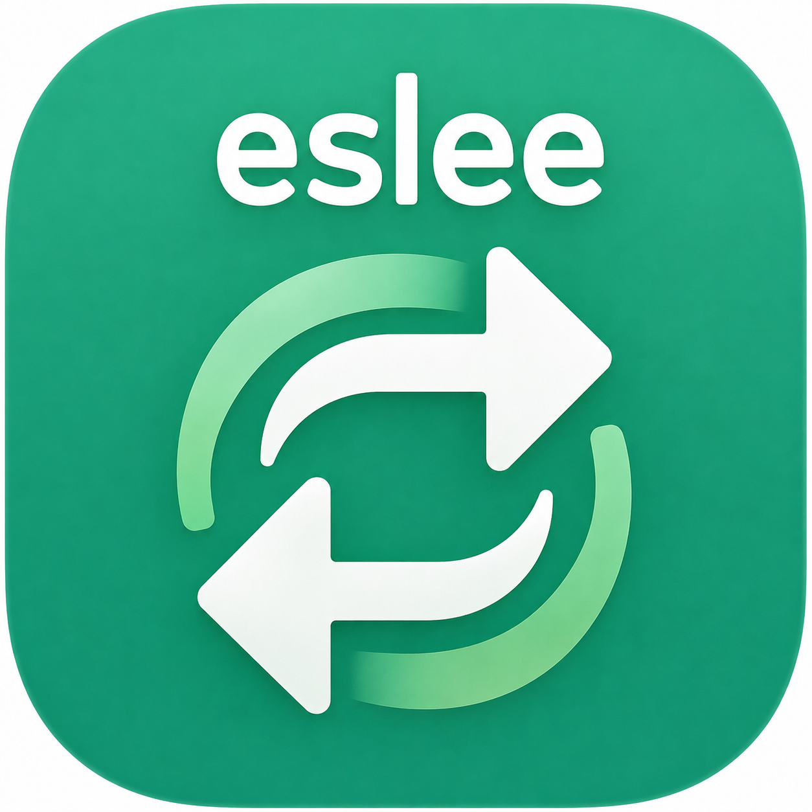
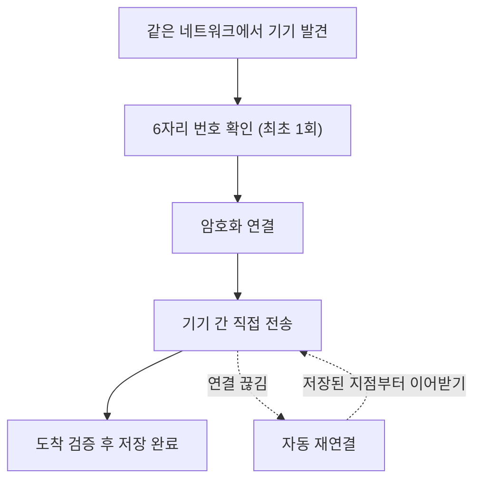

<p align="center">
  
</p>

<h1 align="center">eslee QuickSend</h1>

<p align="center">
  같은 공유기에 연결된 Windows PC와 Android 휴대폰 사이에서 파일과 폴더를 직접 주고받는 프로그램입니다.<br>
  계정이나 클라우드 없이 기기끼리 암호화해 전송하고, 전송이 끊기면 이어서 진행합니다.
</p>

<p align="center">
  <a href="https://github.com/esleeeeee/eslee-quick-send/releases"></a>
  
  
</p>

## 현재 상태

Windows 공개 버전은 **v0.0.3**, Android 공개 APK는 **v0.0.1**로 플랫폼별 버전이 다릅니다. 두 플랫폼 모두 프로토콜 v1을 사용하지만 같은 버전 번호나 실제 호환성 시험 완료를 뜻하지 않습니다.

| 조합 | 이번 자동 검증 | 남은 검증 |
| --- | --- | --- |
| Windows 소스 / 프로토콜 v1 | 청크·정상 재개·파일 보존·저장소·선택 기기 인증 정책 | 실제 PC ↔ PC LAN |
| Windows v0.0.3 / Android 공개 v0.0.1 | 릴리스 바이너리 조합 시험 미실행 | 새 페어링·양방향·화면 꺼짐·대용량 |
| 현재 Android 소스 / Windows 소스 | 플랫폼 단위 시험과 실제 조합 시험은 구분 | 실제 PC ↔ Android 및 장시간 재연결 |

취소는 전송을 중단하며 이미 받은 파일과 미완료 데이터를 자동 삭제하지 않습니다. 수신 폴더는 Windows에 등록된 다운로드 폴더 아래 `eslee QuickSend`입니다. 직접 연결에는 PC 화면의 IP와 포트를 사용합니다.

## 다운로드

모든 파일은 [Releases 페이지](https://github.com/esleeeeee/eslee-quick-send/releases)에서 받을 수 있습니다.

| 사용 환경 | 받을 파일 | 설명 |
| --- | --- | --- |
| Windows 일반 사용자 | `…-Setup.exe` | **권장.** 설치형, 관리자 권한 불필요 |
| Windows에서 설치 없이 시험 | `…-Portable.zip` | 압축을 푼 폴더 안에서 실행 |
| Android 휴대폰 | `…-debug.apk` | 시험용 앱, 직접 설치 필요 |
| (선택) 받은 파일 확인 | `SHA256SUMS.txt` | 파일이 손상 없이 받아졌는지 확인하고 싶을 때 쓰는 값 목록 |

> **`Source code (zip)`과 `Source code (tar.gz)`는 받지 마세요.** GitHub이 자동으로 붙이는 소스 코드 묶음으로, 실행할 수 있는 프로그램이 아닙니다. 개발자가 직접 빌드할 때만 사용합니다.

- 배포 파일은 아직 코드 서명되지 않았습니다. Windows에서 SmartScreen 경고가 나오면 `추가 정보 → 실행`을 선택해야 할 수 있습니다.
- Android APK는 Play 스토어 앱이 아니므로 설치 시 `출처를 알 수 없는 앱` 허용이 필요할 수 있습니다.
- **Android 앱을 업데이트할 때는 기존 앱을 삭제하지 말고 그 위에 덮어쓰기 설치하세요.** 삭제하면 신뢰 기기, 수신 폴더 설정, 전송 기록이 함께 사라집니다.

## 이 프로그램으로 할 수 있는 일

- PC의 사진, 영상, 문서를 휴대폰으로 보내기
- 휴대폰의 파일을 PC로 보내기
- 여러 파일과 폴더를 한 번에 골라 순서대로 전송하기
- 전송 중 Wi-Fi가 끊겨도 다시 연결되면 받던 지점부터 이어받기
- PC 창을 닫아 두어도 트레이에서 계속 파일 받기
- 계정 가입이나 클라우드 업로드 없이 기기끼리 직접 전송하기

## 처음 사용하는 방법

첫 설치부터 양방향 전송까지 순서대로 따라 하면 됩니다.

1. **Windows**: `…-Setup.exe`를 실행해 설치합니다. 설치가 끝나고 처음 실행할 때 Windows 방화벽 허용 창이 뜨면 `개인 네트워크`에 체크하고 `액세스 허용`을 누르세요.
2. **Android**: `…-debug.apk`를 설치하고 앱을 엽니다. 권한 허용 창이 뜨면(알림, 기기에 따라 주변 기기·로컬 네트워크) 모두 허용하고, 화면 상단의 톱니(⚙) 아이콘을 눌러 **받은 파일을 저장할 폴더를 먼저 지정**합니다.
3. PC와 휴대폰을 **같은 공유기**에 연결합니다. PC는 유선(랜선), 휴대폰은 Wi-Fi여도 같은 공유기면 됩니다.
4. 양쪽 앱을 켜 두면 잠시 후 서로의 `주변 기기` 목록에 상대 기기가 나타납니다.
5. 목록에서 상대 기기를 선택합니다.
6. 처음 연결이면 양쪽 화면에 6자리 인증번호가 표시됩니다. **두 기기의 번호가 같은지 확인**하세요.
7. 번호가 같으면 양쪽에서 `신뢰`를 누릅니다. 번호가 다르면 `거부`를 누르세요. 이 확인은 처음 한 번만 합니다.
8. **PC → 휴대폰**: Windows에서 `파일 선택` 또는 `폴더 선택`을 누르거나, 보낼 파일을 QuickSend 창에 끌어다 놓습니다.
9. 전송이 끝나면 휴대폰의 `전송 기록`과 지정한 수신 폴더에서 파일을 확인합니다.
10. **휴대폰 → PC**: Android에서 기기를 선택한 뒤 `파일` 또는 `폴더` 버튼으로 보낼 항목을 고릅니다. PC에서는 `다운로드\eslee QuickSend` 폴더에 저장됩니다.

기기가 목록에 나타나지 않을 때만 Android의 `IP 주소로 직접 연결`을 사용하면 됩니다. 방법은 [문제 해결](#상대-기기가-보이지-않아요)을 참고하세요.

## Windows 사용법

### 파일 보내기

- `주변 기기`에서 받을 기기를 먼저 선택합니다.
- `파일 선택` 또는 `폴더 선택` 버튼으로 보낼 항목을 고르거나, 파일과 폴더를 창 어디에나 끌어다 놓습니다.
- 이미 전송 중일 때 새 항목을 추가하면 대기열에 들어가 순서대로 전송됩니다.
- 전송 중에는 `일시정지`와 `취소` 버튼을 쓸 수 있습니다. `취소`를 누르면 확인 창이 뜬 뒤 전송이 중단됩니다.

### 전송 상태 읽는 법

전송 기록 목록의 상태 표시는 다음을 뜻합니다.

| 표시 | 의미 |
| --- | --- |
| `전송 중` | 지금 전송하고 있음 |
| `대기열 N번째` | 앞 전송이 끝나기를 기다리는 중. 끝나면 자동으로 시작 |
| `기기 연결 대기` | 상대 기기를 아직 찾지 못함 |
| `연결 복구 중` | 연결이 끊겨 자동으로 다시 연결하는 중 |
| `일시정지` | 사용자가 일시정지함 |
| `연결 끊김` | 사용자가 연결을 끊어 보류 중. `다시 연결`하면 이어짐 |

### 전송 기록

- `전송 기록` 목록에서 보낸 기록과 받은 기록을 함께 볼 수 있고, 새 전송이 끝나면 자동으로 갱신됩니다.
- 각 기록 옆 휴지통 버튼으로 개별 삭제, `기록 정리` 버튼으로 완료·취소·실패 기록과 더 이상 진행되지 않는 오래된 기록을 한 번에 삭제할 수 있습니다.
- 기록 삭제는 목록만 정리합니다. 보낸 원본 파일과 받은 파일은 삭제되지 않습니다.

### 연결 끊기와 다시 연결

- 기기를 선택하고 `연결 끊기`를 누르면 그 기기와의 연결만 끊깁니다. 신뢰 등록은 유지됩니다.
- 끊은 상태에서는 자동으로 다시 연결되지 않으며, 같은 자리의 `다시 연결` 버튼을 눌러야 연결됩니다.
- 전송 중에 끊어도 파일은 손상되지 않으며, 다시 연결하면 이어서 전송합니다.

### 창 닫기, 트레이, 완전 종료

- **창 오른쪽 위 X 버튼은 종료가 아닙니다.** 창만 숨고 트레이(작업 표시줄 오른쪽 아이콘 영역)에서 계속 실행되며, 이 상태에서도 파일을 받을 수 있습니다.
- 트레이의 QuickSend 아이콘을 클릭하거나 우클릭 메뉴의 `QuickSend 열기`를 누르면 창이 다시 열립니다.
- 완전히 종료하려면 트레이 아이콘 우클릭 → `종료`를 누릅니다. 전송 중이면 종료 여부를 한 번 더 묻습니다.
- QuickSend를 다시 실행해도 새 창이 하나 더 생기지 않고 기존 창이 열립니다.

### 설정과 기기 이름

- 창 오른쪽 위 톱니(⚙) 버튼을 누르면 `설정`이 열립니다. 여기서 `Windows 시작 시 자동 실행`을 켜고 끌 수 있습니다. 설치할 때 기본으로 켜져 있으며, 자동 실행 시에는 창 없이 트레이에서 시작합니다.
- `이 PC` 카드의 `기기 이름 변경` 버튼으로 상대 기기 목록에 표시될 이름을 바꿀 수 있습니다. 한글 가능, 최대 32자이며, 이름을 바꿔도 신뢰 관계는 유지됩니다.

## Android 사용법

### 파일 보내기

- `주변 기기`에서 보낼 기기를 선택한 뒤 `파일` 또는 `폴더` 버튼으로 보낼 항목을 고릅니다.
- 전송 중에는 화면과 상단 알림에서 진행률, 속도, 남은 시간을 볼 수 있습니다.

### 받은 파일 위치

- 처음 사용할 때 화면 상단의 톱니(⚙) 아이콘 또는 `받은 파일 위치` 카드의 `변경` 버튼으로 수신 폴더를 지정해야 합니다. 지정 전에는 파일을 받을 수 없습니다.
- 받은 파일의 위치는 `내장 저장소/다운로드/…`처럼 읽기 쉬운 경로로 표시됩니다. 전송 기록의 각 항목에서도 저장 위치를 확인할 수 있습니다.

### 전송 기록

- `전송 기록`에서 보낸 기록과 받은 기록을 확인하고, 항목별 휴지통 버튼으로 삭제하거나 `기록 정리`로 한 번에 정리할 수 있습니다.
- 기록 삭제가 실제 파일을 지우지 않는 것은 Windows와 같습니다.

### 연결 끊기와 기기 이름

- 기기 카드의 `연결 끊기` 버튼으로 그 기기와의 연결만 끊을 수 있습니다. 신뢰 등록은 유지되고, `다시 연결`을 누르면 중단된 전송이 이어집니다.
- `이 기기 이름` 카드의 `변경` 버튼으로 표시 이름을 바꿀 수 있습니다. 한글 가능, 최대 32자, 재페어링 없음은 Windows와 같습니다.

### 상단 알림에 대해

- 앱이 연결을 유지하고 화면이 꺼져도 전송을 계속하려면 Android 규칙상 알림이 항상 떠 있어야 합니다. 이 알림은 없앨 수 없는 것이 정상입니다.
- 알림은 상태를 그대로 보여줍니다: 기기를 기다릴 때는 `같은 네트워크의 기기를 기다리는 중`, 연결만 된 상태에서는 `○○에 연결됨`이라는 정적인 문구가 표시됩니다. 실제 전송 중에는 진행률이 표시되고, 연결을 복구하는 동안에는 움직이는 대기 표시가 나타납니다. 전송이 끝나면 몇 초간 `전송 완료`를 보여준 뒤 다시 대기 문구로 돌아갑니다.
- 권한 허용 창은 기기와 Android 버전에 따라 알림(Android 13 이상), 주변 기기, 로컬 네트워크가 나타날 수 있으며, 모두 허용해야 기기 발견과 전송이 정상 동작합니다. 파일 접근은 사용자가 폴더를 직접 선택하는 방식이라 저장소 전체 접근 권한을 요구하지 않습니다.

## Setup과 Portable, 무엇을 받을까요

| 원하는 사용 방식 | 추천 |
| --- | --- |
| 평소에 계속 쓰고, 부팅하면 자동으로 대기 | `…-Setup.exe` |
| 설치 없이 잠깐만 써보기 | `…-Portable.zip` |

- Portable은 압축을 **전부** 푼 뒤 그 폴더 안의 `eslee QuickSend.exe`를 실행합니다. EXE 파일만 따로 복사하면 실행되지 않습니다.
- 설치형과 포터블은 같은 설정과 기록을 공유하므로 둘을 동시에 실행하지 마세요. 포터블로 쓰다가 설치형으로 바꿔도 신뢰 기기와 기록은 그대로 이어집니다.
- 설치형을 제거할 때는 프로그램만 지우고 설정·신뢰 기기·전송 기록은 남기는 것이 기본입니다. 함께 지울지는 제거 중에 물어봅니다.

## 꼭 알아둘 점

- 지원 환경: Windows 10/11 x64(최근의 일반 Windows PC 대부분), Android 8.0 이상. macOS, iOS, Linux는 지원하지 않습니다.
- 두 기기가 **같은 로컬 네트워크**에 있어야 합니다. 인터넷을 통한 원격 전송은 지원하지 않습니다.
- 게스트 Wi-Fi, 회사망, VPN이 켜진 환경에서는 자동 발견이 실패할 수 있습니다. 이때는 `IP 주소로 직접 연결`을 사용하세요.
- 완전히 종료한 앱은 파일을 받을 수 없습니다. Windows는 트레이 상주 상태, Android는 앱이 실행 중이어야 합니다.
- 같은 이름의 파일을 받으면 덮어쓰지 않고 `파일 (1).ext`처럼 새 이름으로 저장합니다.
- 중단된 전송은 7일 안에 다시 연결하면 이어받을 수 있습니다. 7일이 지나면 자동 복구 대상에서 빠지며, 그 파일은 처음부터 다시 보내야 할 수 있습니다.

## 간단한 작동 원리

1. 같은 네트워크 안에서 두 기기가 서로를 찾습니다.
2. 처음 연결할 때 양쪽의 6자리 번호를 사람이 직접 비교해 승인합니다.
3. 승인한 기기와 암호화된 연결을 만듭니다.
4. 파일은 두 기기 사이에서만 직접 이동합니다.
5. 전송이 끊기면, 받는 기기가 저장을 마친 지점부터 이어서 전송합니다.
6. 전송이 끝나면 파일이 손상 없이 도착했는지 검증한 뒤 최종 저장합니다.



## 문제 해결

문제가 계속되면 [GitHub Issues](https://github.com/esleeeeee/eslee-quick-send/issues)에 알려주세요.

### Windows에서 실행되지 않아요

- Portable을 쓴다면: ZIP을 전부 풀었는지, 푼 폴더 안의 EXE를 실행했는지 확인하세요. EXE만 따로 복사하면 실행되지 않습니다.
- SmartScreen 경고가 나오면 `추가 정보 → 실행`을 선택합니다.
- 이미 트레이에서 실행 중일 수 있습니다. 트레이 아이콘을 확인하거나 다시 실행하면 기존 창이 열립니다.

### 상대 기기가 보이지 않아요

- 두 기기가 같은 공유기에 연결됐는지 확인합니다. 게스트 Wi-Fi는 기기 간 통신을 막는 경우가 많습니다.
- 휴대폰이나 PC의 VPN을 잠시 끕니다.
- 휴대폰 설정의 애플리케이션 → QuickSend → 권한에서 알림·주변 기기·로컬 네트워크가 허용되어 있는지 확인합니다.
- 처음 실행할 때 나온 Windows 방화벽 허용 창에서 `액세스 허용`을 눌렀는지 확인합니다. 창을 놓쳤다면 `Windows 보안 → 방화벽 및 네트워크 보호 → 방화벽에서 앱 허용`에서 eslee QuickSend의 `개인` 항목에 체크하세요.
- 양쪽 앱이 모두 실행 중인지 확인하고, Windows의 `주변 기기` 목록 옆 `기기 다시 찾기`를 눌러 봅니다.
- 그래도 안 되면 Android의 `주변 기기` 목록 아래 `IP 주소로 직접 연결`을 누릅니다. PC의 IP 주소는 Windows `설정 → 네트워크 및 인터넷` 연결 속성의 IPv4 주소에서 확인할 수 있고, 포트 칸은 기본값이 이미 입력되어 있으니 그대로 두면 됩니다.

### 6자리 번호가 서로 달라요

- `신뢰`를 누르지 말고 `거부`를 누른 뒤 다시 연결하세요.
- 번호가 다르다는 것은 지금 연결된 상대가 내가 의도한 기기가 아닐 수 있다는 뜻입니다. 번호가 같을 때만 승인하세요.

### 전송이 멈췄어요

- 두 기기의 Wi-Fi/네트워크 상태를 확인합니다. 연결이 회복되면 자동으로 이어서 전송합니다.
- 상태가 `연결 복구 중`이면 잠시 기다립니다. `연결 끊김`이면 `다시 연결`을 누릅니다.
- 앱이 완전히 종료되지 않았는지 확인합니다. Android에서 제조사 배터리 절약 기능이 앱을 강제 종료하면 전송이 멈출 수 있으니, 반복되면 휴대폰 설정에서 QuickSend의 배터리 제한을 완화해 보세요.
- 7일 넘게 중단된 작업은 이어받기가 만료될 수 있습니다. 이때는 파일을 새로 보내면 됩니다.

### Android에서 받은 파일을 못 찾겠어요

- 앱의 `전송 기록`에서 해당 항목의 저장 위치를 확인합니다.
- `받은 파일 위치` 카드에 표시된 폴더를 휴대폰 파일 관리자 앱에서 열어 봅니다.

### 창을 닫았는데 프로그램이 계속 실행돼요

- 정상 동작입니다. X 버튼은 창만 숨기고 트레이에서 계속 파일을 받습니다.
- 완전히 종료하려면 트레이 아이콘 우클릭 → `종료`를 누르세요.

### 기록을 삭제했는데 파일이 남아 있어요

- 정상 동작입니다. 기록 삭제는 목록만 정리하며, 보낸 원본과 받은 파일은 절대 삭제하지 않습니다.
- 파일 자체를 지우려면 파일 탐색기나 휴대폰 파일 관리자에서 직접 삭제하세요.

## 개인정보와 로컬 데이터

- 계정, 로그인, 클라우드 업로드가 없습니다. 파일은 두 기기 사이에서만 이동합니다.
- 분석 도구, 광고, 원격 오류 수집이 없습니다. 앱이 외부 서버로 데이터를 보내는 코드 경로 자체가 없습니다.
- 기기 발견을 위해 **같은 네트워크의 다른 사용자에게 이 기기의 표시 이름이 보일 수 있습니다.** 공용 네트워크에서는 기기 이름에 개인 정보를 넣지 않는 것이 좋습니다.

데이터가 저장되는 곳:

| 플랫폼 | 위치 | 내용 |
| --- | --- | --- |
| Windows | `%LOCALAPPDATA%\eslee\QuickSend` | 설정, 신뢰 기기, 전송 기록, 진단 로그 |
| Windows | `다운로드\eslee QuickSend` | 받은 파일 |
| Android | 앱 내부 저장소 | 설정, 신뢰 기기, 전송 기록, 진단 로그 |
| Android | 사용자가 지정한 폴더 | 받은 파일 |

진단 로그는 Windows의 경우 `%LOCALAPPDATA%\eslee\QuickSend\logs` 폴더에 있습니다. 로그에는 기기 이름, 로컬 IP 주소, 전송 시각, 연결 상태, 오류 정보가 포함될 수 있으므로 **GitHub에 올리기 전에 내용을 직접 확인**하세요. 파일 내용은 로그에 기록되지 않습니다.

## 개발자용 안내

일반 사용자는 이 절을 읽을 필요가 없습니다.

- 필요 도구: .NET 10 SDK, Windows SDK, JDK 21, Android SDK
- 모든 전송은 암호화되며, 연결이 끊기면 수신 측이 저장을 마친 구간부터 이어서 전송합니다. 상세 설계는 [docs/ARCHITECTURE.md](docs/ARCHITECTURE.md)와 [protocol/PROTOCOL.md](protocol/PROTOCOL.md)를 참고하세요.

```powershell
# 빌드와 테스트
dotnet build .\QuickSend.slnx
dotnet run --project .\tests\QuickSend.Core.Tests\QuickSend.Core.Tests.csproj
dotnet run --project .\tests\QuickSend.Windows.Persistence.Tests\QuickSend.Windows.Persistence.Tests.csproj
cd android
.\gradlew.bat testDebugUnitTest
.\gradlew.bat assembleDebug
```

```powershell
# Windows 배포본과 설치 파일
dotnet publish .\src\QuickSend.Windows\QuickSend.Windows.csproj -c Release -r win-x64 --self-contained true
& "$env:LOCALAPPDATA\Programs\Inno Setup 6\ISCC.exe" .\installer\eslee-quicksend.iss

# 앱 아이콘 재생성 (master 원본에서 파생)
powershell -ExecutionPolicy Bypass -File .\tools\generate-icons.ps1
```

```text
src/QuickSend.Core/       프로토콜·상태 머신·복구 핵심 (.NET)
src/QuickSend.Windows/    Windows 앱 (.NET 10 + WinUI 3)
android/                  Android 앱 (Kotlin + Jetpack Compose)
protocol/                 wire protocol 명세
installer/                Inno Setup 설치 스크립트
tools/                    아이콘 생성 등 빌드 보조 스크립트
tests/                    단위·통합 테스트
docs/                     아키텍처, 빌드, 테스트, 검증 문서
```

빌드 절차는 [docs/BUILDING.md](docs/BUILDING.md), 테스트 절차는 [docs/TESTING.md](docs/TESTING.md), 수행한 검증과 미검증 항목은 [docs/VALIDATION.md](docs/VALIDATION.md)에 정리되어 있습니다.

## 지원

- 다운로드: [Releases](https://github.com/esleeeeee/eslee-quick-send/releases)
- 버그 신고와 문의: [Issues](https://github.com/esleeeeee/eslee-quick-send/issues)
