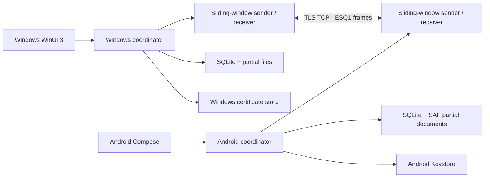

# 아키텍처

## 구성

- `QuickSend.Core`: 32바이트 프레임, control message, 청크 codec, sliding window, Merkle 무결성, 체크포인트, 재시도 정책과 상태 머신
- `QuickSend.Windows`: WinUI 3 UI, TCP/TLS listener, mDNS, Windows 인증서 저장소 identity, SQLite, 파일 시스템 수신, 절전 방지와 시스템 트레이
- `android/app`: Compose UI, foreground connected-device service, NSD, Android Keystore identity, SQLite, SAF 수신 저장소, wake/Wi-Fi/multicast lock
- `protocol`: 두 구현이 공유하는 언어 중립 wire 계약

## 전송 불변 조건

1. 송신 완료 바이트와 안전 완료 바이트를 분리한다. UI의 확정 진행률은 `CHECKPOINT.committedOffset`만 사용한다.
2. 수신 순서는 청크 SHA-256 확인 → 부분 파일 기록 → 정책 시점에 durable flush → DB checkpoint transaction → `CHECKPOINT` 응답이다.
3. 기본 8 MiB 청크를 최대 8개까지 in-flight로 유지한다. ACK reader와 송신 루프는 독립적으로 실행한다.
4. 재연결 시 수신 DB와 실제 부분 파일 중 더 안전한 지점으로 정렬하고, 수신 `RESUME_INFO`가 정한 offset부터 시작한다.
5. 마지막 부분 청크까지 포함한 모든 leaf의 Merkle root와 길이가 맞아야 최종 이름으로 확정한다.

## 보안 경계

각 설치는 P-256 키와 self-signed 인증서를 만든다. private key는 Windows CurrentUser 인증서 저장소 또는 Android Keystore 밖으로 내보내지 않는다. TLS 핸드셰이크 뒤 `HELLO.identityFingerprint`가 실제 peer 인증서의 SPKI SHA-256과 일치하는지 다시 확인한다. 최초 연결은 두 공개키 지문과 nonce로 만든 6자리 SAS를 양쪽에서 승인해야 신뢰 DB에 저장된다.

## 상태와 복구

작업과 파일 상태는 별도 행으로 저장한다. Windows는 SQLite WAL + `synchronous=FULL`, Android는 SQLite WAL + `PRAGMA synchronous=FULL`을 사용한다. 앱 시작 시 미종료 송신 작업과 파일 URI/path를 다시 읽어 재발견·재연결 루프에 넣는다. 수신 작업은 새 연결의 동일한 `fileId`가 기존 partial/checkpoint를 찾아 이어받는다.

복구 가능한 오류에는 상한 없는 `2/5/10/20/30/60…초` backoff를 적용하며 네트워크 주소/NSD 변경 이벤트는 대기를 조기에 깨운다. 손상 청크는 같은 연결에서 두 번 재전송하고 세 번째 실패 시 연결을 재구성한다. 송신 watchdog은 20초 PING과 45초 무응답 기준을 사용한다.

## 자원 한계

파일 전체는 메모리에 올리지 않는다. 기본 최대 in-flight payload는 약 64 MiB이고, Merkle snapshot은 청크당 32바이트다(100 GiB/8 MiB 기준 약 400 KiB). control payload와 chunk payload는 헤더 확인 단계에서 절대 상한을 적용한다.
